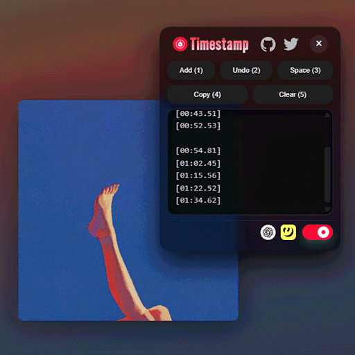

  
  <h1 align="center">Youtube Music Timestamp</h1>

  

<table>
  <thead>
      <tr>
          <th style="text-align:center"><a href="README.md">English</a></th>
          <th style="text-align:center">日本語</th>
      </tr>
    </thead>
</table>

## 概要

**Youtube Music Timestamp** は Youtube Music で簡単にタイムスタンプを追加し､ `.LRC` ファイルを自動的に作ることができます｡

<!-- ## DownloadG -->

## 一緒に使うと便利

このスクリプトは [Better Lyrics](https://chromewebstore.google.com/detail/better-lyrics-lyrics-for/effdbpeggelllpfkjppbokhmmiinhlmg) に感銘を受け､より便利に使いやすくするために作成しました｡  
ぜひ使ってみてください！ 🤝

また､ [Genius Lyrics Copy](https://greasyfork.org/ja/scripts/549204-genius-lyrics-copy) を使用することで Genius 上の歌詞を簡単にコピーすることができます｡

## 機能

### 🎵 `.LRC` ファイルをサクッと作成

曲を再生したら歌詞を見ながらボタンを押すだけ！

### 🔍 簡単な歌詞検索 & 📂 ファイル出力

[Genius](https://genius.com) , [ChatGPT](https://chatgpt.com) を使用した簡単歌詞検索と `.LRC` ファイルのサクッと出力機能

### 🧩 パネルひとつで操作を完結

機能を小さなパネルにひとまとめ！  
ドラッグで移動も可能

### ⌨️ 便利なショートカットキー

`.LRC` ファイルの作成はたった [**3 ステップ**](#使い方) ！  
 [LRCLIBup](https://lrclibup.boidu.dev) に歌詞をアップロードする流れもスムーズに

### 🌏 多言語対応

英語 / 日本語 / 中国語 / 韓国語をサポート

### ⚙️ 便利なおまけ機能

曲が変わったら自動でタイムスタンプをリセット (オン/オフ切り替え可能)  
間違えても安心！ **ちょうどいい**プレイバック

---

- ⏱️ **タイムスタンプ (パネルかショートカットキーで操作可能)**

  - 再生位置のタイムスタンプを追加
  - スペースを挿入
  - ひとつ前のタイムスタンプに戻る
  - タイムスタンプをすべてコピー
  - タイムスタンプをすべて削除

- 🔗 **Genius (パネルかショートカットキーで操作可能)**

  - 曲名とアーティストで検索
  - 曲名で検索
  - アーティストで検索

- 🔗 **ChatGPT (パネルかショートカットキーで操作可能)**  
  タイムスタンプがある状態で ChatGPT リンクを開くとプロンプトが自動的に入力されます｡  
  その後､コピーした歌詞を貼り付け､送信すると `.LRC` 形式のファイルとプレーンな歌詞ファイルが出力されます｡

- ⚙️ **タイムスタンプの自動リセット (パネルかショートカットキーで操作可能)**  
  曲が変わると､5 秒後自動的に保存されているタイムスタンプが削除されます｡デフォルトはオフです｡

- ⌨️ **ちょうどいいプレイバック (ショートカットキーで操作可能)**  
  `W` , `E` , `←` , `→`キーを使って、動画の再生位置を調整できます｡  
  `W` , `E` キーで 3 秒､ `←` , `→` キーで 5 秒プレイバックできます｡

> [!TIP]
> ChatGPT リンクに飛んだとき､新規ページのテキストボックスになにか入力されていると自動挿入されません｡  
> 入力内容をすべて消してから再度開き直してください｡

## ショートカットリスト

| Key | Type         | Description                                |
| --- | ------------ | ------------------------------------------ |
| 1   | ⏱️ Timestamp | 再生位置のタイムスタンプを追加             |
| 2   | ⏱️ Timestamp | スペースを挿入                             |
| 3   | ⏱️ Timestamp | ひとつ前のタイムスタンプに戻る             |
| 4   | 🔗 Link      | Genius を開いて曲名とアーティストで検索    |
| 5   | 🔗 Link      | ChatGPT を開いてプロンプトを自動入力       |
| 6   | 🔗 Link      | その曲の LRCLIBup を開く                   |
| 7   | ⏱️ Timestamp | タイムスタンプをすべてコピー               |
| 8   | ⏱️ Timestamp | タイムスタンプをすべて削除                 |
| 9   | ⚙️ Toggle    | タイムスタンプの自動リセット機能を切り替え |
| 0   | ⚙️ Toggle    | パネルを開閉                               |
| W   | ⌨️ Playback  | 3 秒巻き戻し                               |
| E   | ⌨️ Playback  | 3 秒早送り                                 |
| ←   | ⌨️ Playback  | 5 秒巻き戻し                               |
| →   | ⌨️ Playback  | 5 秒早送り                                 |

## 使い方

基本の流れはこんな感じ 👉

1. 楽曲再生時､下部プレイヤーバーかショートカットキーからパネルを開く

2. Genius で曲を検索し、歌詞を見ながらタイムスタンプを入力する

3. ChatGPT を開いて歌詞を貼り付け 後は自動的に作成されます！

これだけで OK！

さらに `6`キーで LRCLIBup へのアップロードもスムーズ

## ライセンス

このプロジェクトは、 [GNU GPLv3 License](LICENCE) ライセンスに基づきます。
