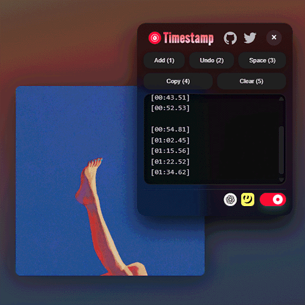

 
 <h1 align="center">Youtube Music Timestamp</h1>

 

## Overview

**YouTube Music Timestamp** is easily add timestamps to YouTube Music and automatically create `.LRC` files.

<!-- ## Download -->

## Works Best With

This script was inspired by [Better Lyrics](https://chromewebstore.google.com/detail/better-lyrics-lyrics-for/effdbpeggelllpfkjppbokhmmiinhlmg) and created to make it even more convenient and user-friendly.  
Please give it a try! 🤝

## Features

### 🎵 Create `.LRC` Files Instantly

Just play a song, look at the lyrics, and press buttons!

### 🔍 Easy Lyrics Search & 📂 File Export

Easy lyrics search using [Genius](https://genius.com) and [ChatGPT](https://chatgpt.com), with instant `.LRC` file export functionality

### 🧩 Complete Operations in One Panel

All features combined in a small panel!  
Draggable for easy positioning

### ⌨️ Convenient Shortcut Keys

Creating `.LRC` files takes just [**3 steps**](#usage)!  
Smooth workflow for uploading lyrics to [LRCLIBup](https://lrclibup.boidu.dev)

### 🌏 Multi-language Support

Supports English / Japanese / Chinese / Korean

### ⚙️ Useful Extra Features

Automatically reset timestamps when songs change (toggleable on/off)

---

- ⏱️ **Timestamps (Controllable via panel or shortcut keys)**

- Add timestamp at current playback position
- Insert space
- Go back to previous timestamp
- Copy all timestamps
- Delete all timestamps

- 🔗 **Genius (Controllable via panel or shortcut keys)**

- Search by song title and artist
- Search by song title only
- Search by artist only

- 🔗 **ChatGPT (Controllable via panel or shortcut keys)**  
  When you open the ChatGPT link with timestamps present, the prompt is automatically entered.  
  Then paste the copied lyrics and send to output `.LRC` format files and plain lyrics files.

- ⚙️ **Automatic Timestamp Reset (Controllable via panel or shortcut keys)**  
  When the song changes, saved timestamps are automatically deleted after 5 seconds. Default is off.

> [!TIP]
> When navigating to the ChatGPT link, if there's any content in the new page's text box, auto-insertion won't work.  
> Clear all input content and try opening again.

## Shortcut List

| Key | Type         | Description                                   |
| --- | ------------ | --------------------------------------------- |
| 1   | ⏱️ Timestamp | Add timestamp at current playback position    |
| 2   | ⏱️ Timestamp | Insert space                                  |
| 3   | ⏱️ Timestamp | Go back to previous timestamp                 |
| 4   | 🔗 Link      | Open Genius and search by song title & artist |
| 5   | 🔗 Link      | Open ChatGPT with auto-input prompt           |
| 6   | 🔗 Link      | Open LRCLIBup for this song                   |
| 7   | ⏱️ Timestamp | Copy all timestamps                           |
| 8   | ⏱️ Timestamp | Delete all timestamps                         |
| 9   | ⚙️ Toggle    | Toggle automatic timestamp reset feature      |
| 0   | ⚙️ Toggle    | Open/close panel                              |

## Usage

The basic workflow is like this 👉

1. When playing a song, open the panel from the bottom player bar or shortcut keys

2. Search for the song on Genius and enter timestamps while viewing the lyrics

3. Open ChatGPT, paste the lyrics, and it will be created automatically!

That's all you need!

Plus, use the `6` key for smooth uploading to LRCLIBup

## License

This project is licensed under the [GNU GPLv3 License](LICENCE).
